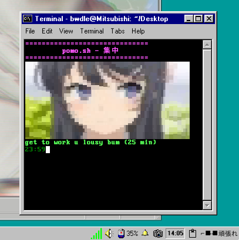

## 🍵 pomo.sh - 集中 


a pomodoro timer in bash. work in focused bursts followed by short breaks to boost productivity. after humble requests from sakurajima mai san (real), ive also added a todolist to it. 

### features
#### pomodoro
- 25-minute work sessions followed by 5-minute breaks.
- repeats for up to 4 cycles.
- displays a countdown timer in the terminal.
- play alarm sound at the end of each session.
#### todolist
- add and complete tasks
- tasks saved in .txt file (real persistent)

### installation

#### from source

1. clone the repository:
   ```bash
   $ git clone https://github.com/USERNAME/REPOSITORY.git
   $ cd pomo-script
    ```
2. make the script executable:

    ```bash
    $chmod +x src/pomo.sh
    ```
#### debian package

if you prefer to install the script as a debian package, you can download the latest `.deb` file from the releases director or <a href ="https://github.com/shvpnd/pomo.sh/releases/">releases</a>.

to install the package, run:

```bash
sudo dpkg -i releases/pomo.deb
```
after installation, you can run the script with:

```bash
pomo.sh
```

### demo

behold, looks like this:



